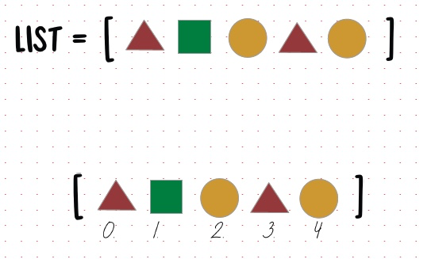
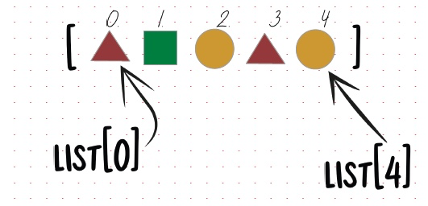
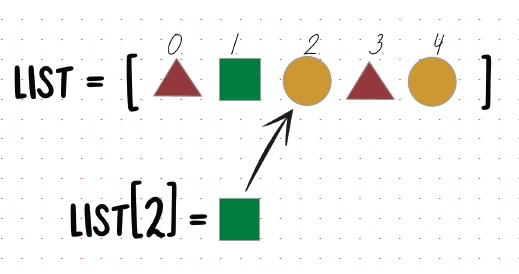
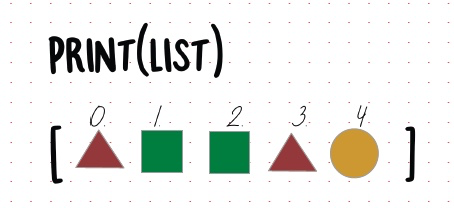
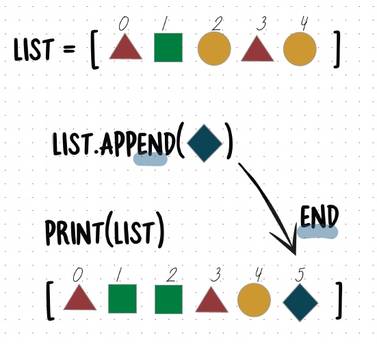

# No Fluff Guide to Python - P5 - Lists

[Complete Blog Post](https://www.databasewithfun.com/2023/07/no-fluff-guide-to-python-p5-lists.html)
> To build up a library is to create a life. It's never just a random collection of books

Imagine you have a box of toys. You can put different toys in the box, like a doll, a car, and a ball. Each toy has its own place in the box. You can also take toys out of the box and play with them.

A Python array is like a box of toys, but it can only hold numbers. Each number has its own place in the array. You can also add and remove numbers from the array.

To create an array, you use the [ ] brackets. For example, the following code creates an array with the numbers 1, 2, and 3:

array = [1, 2, 3]

You can access the numbers in the array using the [ ] brackets. For example, the following code prints the first number in the array:

array = [1, 2, 3]

print(array[0])

Each item in the list is assigned an Index, starting from 0

You can access individual item using these indexes:

You can also change the numbers in the array using these indexes.

For example, the following code changes the first value in the array to "morning":

list1=["hello",1,4,8,"good"]
list1[0]="morning"   

New List\
["morning",1,4,8,"good"]

Update the 3rd item in the list, i.e. index 2

New list looks like this:

You can also add and remove numbers from the array. To add a number to the end of the array, you use the append() method. 

